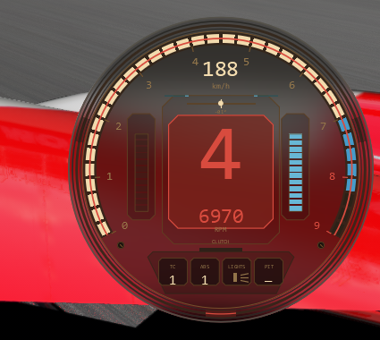

# Retro Engineering HUD

The HUD broadcasts its selected theme and opacity settings to compatible CSP Lua apps once per second, allowing companion instruments to stay visually synchronized.

A compact retro motorsport HUD for Assetto Corsa, built as a native Custom Shaders Patch Lua app.

## Features

- Digital and analog instrument modes.
- Central speed/gear readout, RPM arc, redline and shift alerts.
- Embedded, blinking bezel indicators.
- Brake/throttle bars, TC, ABS, lights, pit status and clutch display.
- Optional turbo or fuel lower gauge in analog mode.
- Light and dark dial themes.
- Persistent visual, RPM and display settings.

## Requirements

- Assetto Corsa (PC).
- Custom Shaders Patch with Lua apps enabled.
- Content Manager is recommended.

## Install

1. Download `RetroEngineeringHUD-v1.0.2.zip` from [Releases](../../releases).
2. Drag the ZIP into Content Manager and accept the install prompt.
3. Enable **Retro Engineering HUD** in the in-game Lua app sidebar.

For a manual install, extract the archive into the Assetto Corsa root. It contains `apps/lua/RetroEngineeringHUD/`.

Use the app settings window to switch between the digital and analog layouts, choose the light or dark theme, set the RPM thresholds, and tune scale and transparency.

## License

[MIT](LICENSE)
